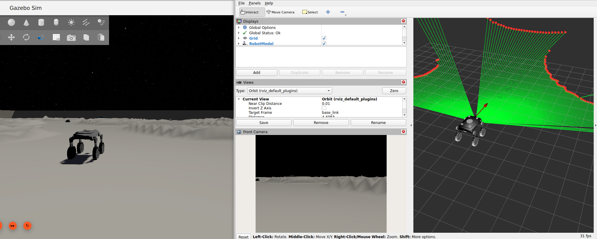

# ThiRover

ROS 2 Jazzy + Gazebo rover simulation stack for the THI rover project.

The active workflow uses the persistent Docker container
`thi_lunar_challenge_gz_jazzy_gui`. The repository is mounted inside the
container at `/workspace/thi_lunar_challenge`.
The public image is:

```text
ghcr.io/turnwald/thirover-gz-jazzy-gui:latest
```
The repository is:

```text
https://github.com/THI-Robotics-Lab/thi_lunar_challenge.git
```

## How to Use

### Clone

```bash
git clone https://github.com/THI-Robotics-Lab/thi_lunar_challenge.git thi_lunar_challenge
cd thi_lunar_challenge
```

### Start

Open one WSL terminal in the repository and start the main simulation path:

```bash
./scripts/run_gazebo_rover_gui_rviz_rays.sh
```

In a second WSL terminal, start remote control:

```bash
./scripts/run_gazebo_rover_remote_control.sh
```

### Move

Use the remote control terminal to drive the rover.

### See

Open RViz with the main launch or view the initial setup image below.



## Technical Details

### Repository Map

- `ros2_ws/src/rover_description`: rover URDF/Xacro and meshes.
- `ros2_ws/src/rover_gazebo`: Gazebo world, launch file, controller config, RViz config, and command/odometry relay nodes.
- `ros2_ws/src/rover_autonomy`: rover autonomy examples, including an odometry-only baseline and a LiDAR control example.
- `scripts`: WSL/Docker helper scripts for build, Gazebo, RViz, teleop, and checks.

The main simulation launch file is:

```bash
ros2 launch rover_gazebo gazebo_rover.launch.py gui:=true
```

Most users should start it through the helper script shown below.

### Build

From the WSL terminal:

```bash
./scripts/check_setup.sh
./scripts/start_gazebo_container.sh
./scripts/gazebo_dev_shell.sh
```

Inside the dev shell:

```bash
cd /workspace/thi_lunar_challenge/ros2_ws
source /opt/ros/jazzy/setup.bash
colcon build --symlink-install --packages-select rover_description rover_gazebo rover_autonomy
source install/setup.bash
```

### Docker Image

The startup scripts try to pull the public image first. If you need to rebuild
it locally, use:

```bash
./scripts/build_gazebo_image.sh
```

To publish the rebuilt image to GHCR:

```bash
./scripts/push_gazebo_image.sh
```

### Start Gazebo

Open a WSL terminal in the repository and run:

```bash
./scripts/run_gazebo_rover_gui_rviz_rays.sh
```

In a second WSL terminal, start remote control:

```bash
./scripts/run_gazebo_rover_remote_control.sh
```

For a headless run:

```bash
./scripts/run_gazebo_rover_headless.sh
```

RViz and keyboard teleop are available separately:

```bash
./scripts/run_gazebo_rover_rviz.sh
./scripts/run_gazebo_rover_teleop.sh
```

### Rover Autonomy

#### Odometry-only Baseline

Start Gazebo first. Then open a second WSL terminal in the repository and run:

```bash
./scripts/exec_in_gazebo_container.sh --user bash -lc 'cd /workspace/thi_lunar_challenge/ros2_ws && source /opt/ros/jazzy/setup.bash && source install/setup.bash && ros2 launch rover_autonomy autonomy_controller.launch.py'
```

Equivalent direct ROS command inside a sourced container shell:

```bash
ros2 run rover_autonomy autonomy_controller --ros-args -p use_sim_time:=true
```

The starter controller uses only `/odom` as sensor input and publishes safe,
low-speed velocity commands to `/cmd_vel`.

#### LiDAR Control Example

Start Gazebo first. Then open another WSL terminal in the repository and run:

```bash
./scripts/exec_in_gazebo_container.sh --user bash -lc 'cd /workspace/thi_lunar_challenge/ros2_ws && source /opt/ros/jazzy/setup.bash && source install/setup.bash && ros2 launch rover_autonomy lidar_control.launch.py'
```

Equivalent direct ROS command inside a sourced container shell:

```bash
ros2 run rover_autonomy lidar_control --ros-args -p use_sim_time:=true
```

This example subscribes to `/odom` and `/scan`, drives forward slowly when the
front LaserScan sector is clear, and turns slowly when an obstacle is too close.

### Write Your Algorithm Here

Edit the odometry-only baseline here:

```text
ros2_ws/src/rover_autonomy/rover_autonomy/autonomy_controller.py
```

Edit the LiDAR-based example here:

```text
ros2_ws/src/rover_autonomy/rover_autonomy/lidar_control.py
```

Look for:

```text
WRITE YOUR ALGORITHM HERE
```

The starter example:

- reads rover position and yaw from `/odom`,
- drives forward a short distance,
- turns left,
- stops,
- publishes zero velocity if odometry is missing.

Both controllers keep the code intentionally small. The odometry-only baseline
is the simplest place to start, and `lidar_control.py` is the next step once
you want to react to obstacles from the LaserScan topic.

### Autonomy Workflow

1. Edit `ros2_ws/src/rover_autonomy/rover_autonomy/autonomy_controller.py`.
2. Rebuild:

   ```bash
   ./scripts/gazebo_dev_shell.sh bash -lc 'cd /workspace/thi_lunar_challenge/ros2_ws && source /opt/ros/jazzy/setup.bash && colcon build --symlink-install --packages-select rover_autonomy'
   ```

3. Start the main simulation path:

   ```bash
   ./scripts/run_gazebo_rover_gui_rviz_rays.sh
   ```

4. Run remote control in a second terminal:

   ```bash
   ./scripts/run_gazebo_rover_remote_control.sh
   ```

5. Run the odometry-only baseline in a second terminal:

   ```bash
   ./scripts/exec_in_gazebo_container.sh --user bash -lc 'cd /workspace/thi_lunar_challenge/ros2_ws && source /opt/ros/jazzy/setup.bash && source install/setup.bash && ros2 launch rover_autonomy autonomy_controller.launch.py'
   ```

6. Or run the LiDAR control example:

   ```bash
   ./scripts/exec_in_gazebo_container.sh --user bash -lc 'cd /workspace/thi_lunar_challenge/ros2_ws && source /opt/ros/jazzy/setup.bash && source install/setup.bash && ros2 launch rover_autonomy lidar_control.launch.py'
   ```

7. Check your changes:

   ```bash
   git status
   git diff
   ```

8. Commit and push:

   ```bash
   git add ros2_ws/src/rover_autonomy/rover_autonomy/autonomy_controller.py
   git add ros2_ws/src/rover_autonomy/rover_autonomy/lidar_control.py
   git commit -m "Implement my odometry controller"
   git push
   ```

### Smoke Checks

After Gazebo is running:

```bash
./scripts/exec_in_gazebo_container.sh --user bash -lc 'cd /workspace/thi_lunar_challenge/ros2_ws && source /opt/ros/jazzy/setup.bash && source install/setup.bash && ros2 topic list'
./scripts/exec_in_gazebo_container.sh --user bash -lc 'cd /workspace/thi_lunar_challenge/ros2_ws && source /opt/ros/jazzy/setup.bash && source install/setup.bash && ros2 control list_controllers'
./scripts/exec_in_gazebo_container.sh --user bash -lc 'cd /workspace/thi_lunar_challenge/ros2_ws && source /opt/ros/jazzy/setup.bash && source install/setup.bash && ros2 topic echo /odom --once'
./scripts/exec_in_gazebo_container.sh --user bash -lc 'cd /workspace/thi_lunar_challenge/ros2_ws && source /opt/ros/jazzy/setup.bash && source install/setup.bash && ros2 topic info /scan'
./scripts/exec_in_gazebo_container.sh --user bash -lc 'cd /workspace/thi_lunar_challenge/ros2_ws && source /opt/ros/jazzy/setup.bash && source install/setup.bash && ros2 topic echo /scan --once'
```

Open RViz with:

```bash
./scripts/run_gazebo_rover_rviz.sh
```

The default RViz config includes the robot model, odometry, TF, `/scan` points,
and `/scan_rays` marker rays with `odom` as the fixed frame. To draw ray
segments from the LiDAR origin to finite scan returns, start the ray overlay in
another WSL terminal while Gazebo is running:

```bash
./scripts/exec_in_gazebo_container.sh --user bash -lc 'cd /workspace/thi_lunar_challenge/ros2_ws && source /opt/ros/jazzy/setup.bash && source install/setup.bash && ros2 launch rover_autonomy scan_rays.launch.py'
```

If you want Gazebo, RViz, and the ray overlay in one shot, use:

```bash
./scripts/run_gazebo_rover_gui_rviz_rays.sh
```

If you want the main combined path plus remote control from the terminal, use:

```bash
./scripts/run_gazebo_rover_remote_control.sh
```

See [docs/setup_wsl_docker.md](docs/setup_wsl_docker.md) and
[docs/architecture.md](docs/architecture.md) for more background.
